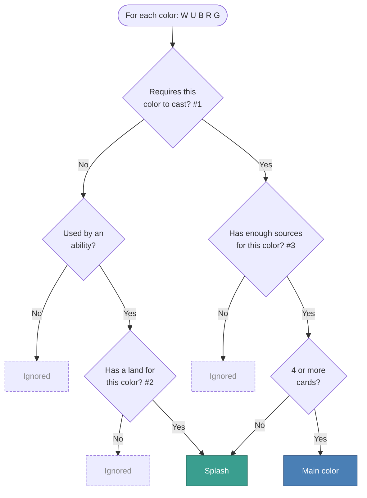

Ever looked up a deck on the site and noticed unexpected splash colors?

The classification logic has served us well for years, but the way it handled hybrid cards, activated abilities and a handful of edge cases was worth revisiting. We recently reworked how deck colors are determined. I'll explain what changed and why.

## Why it matters

Deck color labels aren't just cosmetic: they decide how your draft is categorized in the aggregate data, feeding color-based win rate breakdowns and archetype filters across the site. A mislabeled deck is a small annoyance on its own, but over thousands of drafts it quietly distorts the numbers.

## What was happening



Take this [ECL deck](https://www.17lands.com/deck/3eed8ff9699c4e208e7ddcf5a480b492/) for example, playing only Islands/Mountains, featuring <scryfall-card>Deceit</scryfall-card> and <scryfall-card name="Tam, Mindful First-Year">Tam</scryfall-card>. This was previously labeled as <b>URbg</b>. Hybrids were counted as both colors, and a single treasure-making source in <scryfall-card>Flamekin Gildweaver</scryfall-card> was enough to consider them as splashes.

## #1. Hybrids pick one color



This [UG deck](https://www.17lands.com/deck/70961870953f464885d0ec5fe5179b63/0) plays seven different hybrid cards spanning every color. <scryfall-card>Great Forest Druid</scryfall-card> in there is a five-color mana source (more on this later), which was previously treated as a license to splash everything. So both sides of each hybrid card produced splashes and even a main color with 4 "red" cards.

> **New Rule:**  
> Hybrid cards pick the color with more sources.
{: .prompt-info style="font-size:1.2em" }



A subtler case in this [GW deck](https://www.17lands.com/deck/688e3fec6e584523982a621de6d3a117/0): <scryfall-card>Taster of Wares</scryfall-card> is a genuine <p-b splash></p-b> splash. The <p-rw splash></p-rw> hybrid is handled by the previous fix, so red is no longer a splash enabled by the any-color mana producer. The <p-wb splash></p-wb> hybrid commits to white given the mana base. Finally, two copies of <scryfall-card name="Trystan, Callous Cultivator">Trystan</scryfall-card> with a black activated ability backed by a Swamp. Together that used to look like a main black, but now reads as a 3-card black splash.

But what if you were playing a card like Trystan without expecting to use its ability?

## #2. Abilities need a land



This [UR deck](https://www.17lands.com/deck/337a98e4cd854558b3d75985998bd37e/) is playing <scryfall-card name="Oko, Lorwyn Liege">Oko</scryfall-card> which has a <p-g splash></p-g> activated ability, but not a single Forest. While the deck can _technically_ activate it using Treasures or <scryfall-card>Foraging Wickermaw</scryfall-card>, we decided it was better to recognize <b>commitment to splashing</b> the card by playing a land of the required color instead of relying on conditional sources.

> **New Rule:** Ability splashes need a dedicated land.
{: .prompt-info style="font-size:1.2em" }

Multi-color abilities work the same way: every off-color still needs its own land.



This [UBG deck](https://www.17lands.com/deck/befbbc9cfe9a4bf8bd5f54e488007d7a/0) plays <scryfall-card>Everything Pizza</scryfall-card> but has no Plains or Mountain. Previously, a single five-color source like <scryfall-card>Omni-Cheese Pizza</scryfall-card> was enough to enable the <p-w splash></p-w><p-r splash></p-r> splashes. Now, without a dedicated land for either color, both drop.

---

Additionally, TMT featured a lot of off-color abilities and we were seeing decks labeled with more main colors than their mana base actually committed to.



This [UG deck](https://www.17lands.com/deck/846b2639715140ad8ec9c3a5612315ea/0) plays four copies of <scryfall-card>Everything Pizza</scryfall-card>, which has a WUBRG activated ability, with <scryfall-card>Frog Butler</scryfall-card> providing the off-color sources. Previously this would be treated as having 4 cards with WUBRG casting cost. Now, ability colors can splash but aren't considered for main color, so we consider <p-w splash></p-w><p-b splash></p-b><p-r splash></p-r> as splashes.

> **New Rule:** Abilities don't count for main colors.
{: .prompt-info style="font-size:1.2em" }

 
If you made it this far, there's one topic left: non-land sources.

Should one <scryfall-card>Manalith</scryfall-card> or Treasure maker be enough to splash every color?

## #3. Sources required per pip



This [WR deck](https://www.17lands.com/deck/42276cd1a3fa49778f78ebd31949acbf/0) splashes <p-u splash></p-u> with no Island: the off-color pip is covered by Treasure sources. Previously a single non-land source would have been enough, even for multi-pip cards. This deck has multiple, so it keeps the splash.

> **New Rule:** Two non-land sources cover one pip.
{: .prompt-info style="font-size:1.2em" }

This rule was aimed mostly at cube, where it's more common to play cards with no intention of casting them: <scryfall-card>Reanimate</scryfall-card> and <scryfall-card>Flash</scryfall-card> decks often feature these.



This [BR cube deck](https://www.17lands.com/deck/0a71949184074ce6a10d838a83545a81/0) plays <scryfall-card>Woodfall Primus</scryfall-card>, <scryfall-card name="Torsten, Founder of Benalia">Torsten</scryfall-card> and <scryfall-card name="Sin, Spira's Punishment">Sin</scryfall-card>: heavy off-color creatures the deck plans to cheat into play, not hard-cast.  Take Woodfall Primus' <p-g splash></p-g><p-g splash></p-g><p-g splash></p-g>: <scryfall-card>Multiversal Passage</scryfall-card> is the deck's only green-producing land, covering one pip. The remaining two would need <b>four non-land green</b> sources and the deck has just <scryfall-card>Fable of the Mirror-Breaker</scryfall-card>. Same story for white and blue, so under the new rule all three splashes are dropped.

## How it all fits together

 

Beyond the three big rules, a handful of smaller cases also got cleaned up: lands with off-color abilities like <scryfall-card>Hanweir Battlements</scryfall-card> and <scryfall-card>Gavony Township</scryfall-card> now register as ability splashes, split cards like <scryfall-card>Life // Death</scryfall-card> where one half is uncastable get correctly classified, and multicolor cards like <scryfall-card name="Atraxa, Grand Unifier">Atraxa</scryfall-card> are skipped entirely when uncastable instead of adding partial splashes.
{: style="font-size:0.9em" }

---

I hope you enjoyed this look under the hood at how we approached the problem. A couple of these cases involve some ambiguity, so we optimized for simplicity over precision: Simple is better than complex.

We expect these rules to hold up well across future formats, but will continue adjusting if the situation calls for it.

In the coming weeks we'll re-aggregate the recent formats most affected by these changes, like ECL and TMT.

Found a deck that still looks off? Let us know in [our Discord](https://discord.gg/W5eaT7A).